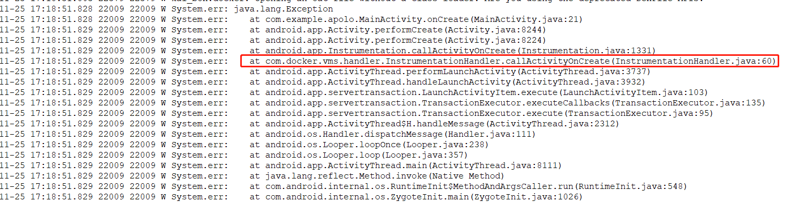
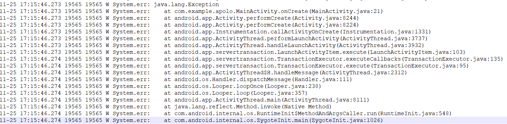
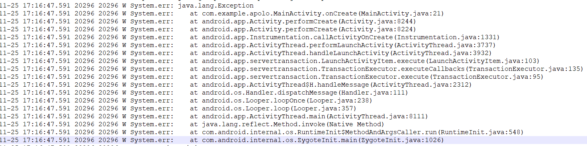

# MultiApp


## 微信群组
请先加微信：WaxMoon2018

## 维护情况

该仓库大概一星期更新一次，请留意文末的更新日志

## 项目简介
MultiApp是一款虚拟安卓容器，可实现app多开，该工程提供了一个简易的UI供您体验，您也可以下载[官网安装包](https://play.google.com/store/apps/details?id=com.waxmoon.ma.gp)享受更流畅的体验。如果您是一个android开发者，也可以自已定制UI，您不用关注底层的实现细节，使用[opensdk](https://github.com/WaxMoon/opensdk)提供的api即可实现app多开。如果您在体验过程中有任何问题，可直接咨询微信账号。

另外，团队会持续修复问题以及更新opensdk，为您提供最佳的体验。

## 最佳实践

你可能需要到这个[项目仓库](https://github.com/WaxMoon/MultiAppDemo)，下载并学习基本的代码

### **您可以观看如下视频了解我们的功能**

[免安装google play](https://github.com/WaxMoon/MultiApp/blob/5fc33308ca9fd651ce7be2a5bab53160d5303426/docs/res/github_gp.mp4) <----> [多开facebook](https://github.com/WaxMoon/MultiApp/blob/5fc33308ca9fd651ce7be2a5bab53160d5303426/docs/res/github_fb.mp4)


https://user-images.githubusercontent.com/118731992/204190831-4bd2c0db-6682-48d8-aa4f-1e5b5756650e.mp4


https://user-images.githubusercontent.com/118731992/204192759-14984680-e5ed-4685-a0c7-bebff3d8a7b0.mp4


<div align=center>
    <video width="320" height="320" controls>
        <source src="res/github_gp.mp4" type="video/mp4">
    </video>
    <video width="320" height="320" controls>
        <source src="res/github_fb.mp4" type="video/mp4">
    </video>
</div>

我们也支持某些传统多开软件的运行

## 方案简介
传统的多开方案依赖于java动态代理、inline hook、代理转发等手段保证虚拟进程的正常运行。如果三方app同样使用了java动态代理，此时会存在代理相互覆盖的问题，该情况会导致三方app运行时的逻辑发生变化。逻辑‘被’发生变化是极大多数厂家不愿意看到的，可能在一定程度上影响其收益。所以从某种意义上来讲，传统方案并不能定义为容器。

MultiApp技术选型之初就抛弃了动态代理，service、receiver、provider等binder组件也均由MultiApp engine自行维护。很遗憾的是Activity组件必须通过代理维护其生命周期，但是我们使用了更底层的机制确保不会影响app的运行时逻辑。另外，在native hook技术上，我们基于seccomp/bpf自研了更为有效的svc hook方案，并在某些场景下启用，综合来看更接近沙盒容器的概念。

### 下面我做了两个简单的实验

**1) 在Activity.onCreate函数中打印代码栈，并分别用传统多开软件、MultiApp、本机打开运行**

```Java
public class MainActivity extends ButtonActivity {

    final static String TAG = "MainActivity";

    @Override
    protected void onCreate(Bundle savedInstanceState) {
        super.onCreate(savedInstanceState);
        new Exception().printStackTrace();
    }
}
```

第一张图片为传统多开软件的异常代码栈，第二张为MultiApp运行的代码栈，第三张为系统本机运行的代码栈。

MultiApp与本机的代码栈一致。







**2) 判断ActivityManager的binder接口是否被动态代理，并分别在传统多开软件、MultiApp中运行**

```Java
public class MainActivity extends ButtonActivity {

    @Override
    protected void onCreate(Bundle savedInstanceState) {
        super.onCreate(savedInstanceState);
        new Exception().printStackTrace();

        {
            try {
                Class<?> class_ActivityManagerNative = Class.forName("android.app.ActivityManagerNative");

                Method method_getDefault = class_ActivityManagerNative.getDeclaredMethod("getDefault");

                IInterface remote_ActivityManager = (IInterface) method_getDefault.invoke(null);

                boolean isProxy = remote_ActivityManager instanceof Proxy;

                Log.d("WaxMoon", String.format("ActivityManager(%s) is proxy: %s", remote_ActivityManager, isProxy));

            } catch (Exception ignore) {

            }
        }
    }
}
```

传统多开日志
```Text
11-25 17:56:38.823  5153  5153 D WaxMoon : ActivityManager(android.app.IActivityManager$Stub$Proxy@8abaec7) is proxy: true
```

MultiApp日志
```Texx
11-25 17:59:13.804  8197  8197 D WaxMoon : ActivityManager(android.app.IActivityManager$Stub$Proxy@79f3e55) is proxy: false
```

## 快速上手
### 代码下载
由于使用了submodule,您必须手动拉取子仓
```shell
git clone https://github.com/WaxMoon/MultiApp.git
git submodule update --init
```

### 继承HackApplication
HackApplication它会帮您完成engine的初始化
```Java
public class MoonApplication extends HackApplication {
    @Override
    protected void attachBaseContext(Context base) {
        super.attachBaseContext(base);
    }

    @Override
    public void onCreate() {
        super.onCreate();
    }
}
```
您也可以参考opensdk代码，自己进行engine的初始化。
```Java
public class HackApplication extends Application {

    private static final boolean DEBUG = Features.DEBUG;
    private static final String TAG = HackApplication.class.getSimpleName();

    @Override
    protected void attachBaseContext(Context base) {
        super.attachBaseContext(base);
        if (DEBUG) Log.d(TAG, "attachBaseContext start");
        HackRuntime.install(this, "version", true);
        Cmd.INSTANCE().exec(CmdConstants.CMD_APPLICATION_ATTACHBASE, this, base);
        if (DEBUG) Log.d(TAG, "attachBaseContext end");
    }

    @Override
    public void onCreate() {
        super.onCreate();
        if (DEBUG) Log.d(TAG, "onCreate start");
        Cmd.INSTANCE().exec(CmdConstants.CMD_APPLICATION_ONCREATE);
        if (DEBUG) Log.d(TAG, "onCreate end");
    }
}
```

### 使用HackApi.installPackageFromHost安装app
```Kotlin
var install: (ApkInfo)->Unit = { apkInfo ->
    val ret = HackApi.installPackageFromHost(apkInfo.pkgName, userSpace, false)

    when (ret) {
        INSTALL_SUCCEEDED ->
            Toast.makeText(MoonApplication.INSTANCE(), R.string.toast_success,
                Toast.LENGTH_SHORT).show()
        INSTALL_FAILED_ALREADY_EXISTS ->
            Toast.makeText(MoonApplication.INSTANCE(), R.string.toast_already_installed,
                Toast.LENGTH_SHORT).show()
        else ->
            Toast.makeText(MoonApplication.INSTANCE(), R.string.toast_fail, Toast.LENGTH_SHORT).show()
    }
}
```

### 也可以调用installApkFiles传递apk路径安装app

```Java
    /**
     * install the apk/apks that is not installed on the system.
     * @param apkPathOrDir if this app is a full apk file, apkPathOrDir should pass an absolute path,
     *                     such as /sdcard/com.xx.yy/com.xx.yy.apk;
     *
     *                     if this app is split apk files, apkPathOrDir should pass the directory
     *                     containing all the apk files for this app, such as /sdcard/com.xx.yy/,
     *                     and this directory can't contain apk files that do not belong to the current app.
     *
     * @param userId
     * @param forceInstall
     * @return public static final int INSTALL_SUCCEEDED = 1;
     */
    public static int installApkFiles(String apkPathOrDir, int userId, boolean forceInstall) {
        ...
    }
```

### 使用HackApi.startActivity运行app

```Kotlin
var startApp: (ApkInfo)->Unit = { apkInfo ->
    var intent:Intent? = null
    if (apkInfo.sysInstalled) {
        intent = MoonApplication.INSTANCE().packageManager.getLaunchIntentForPackage(apkInfo.pkgName)
        intent?.addFlags(Intent.FLAG_ACTIVITY_RESET_TASK_IF_NEEDED)
    } else {
        Toast.makeText(MoonApplication.INSTANCE(), R.string.toast_unsupport, Toast.LENGTH_SHORT).show()
    }

    if (intent != null) {
        Log.d(TAG, "begin start " + apkInfo.pkgName)
        val startRet = HackApi.startActivity(intent, userSpace)
        if (startRet != START_SUCCESS) {
            Toast.makeText(MoonApplication.INSTANCE(), R.string.toast_fail, Toast.LENGTH_SHORT).show()
        }
    }
}
```

### 使用HackApi.registerApplicationCallback监控Application的生命周期

```Java
    private void monitorApplicationEvent() {
        final String TAG = "EVENT";
        HackApi.registerApplicationCallback(new HackApi.ApplicationCallback() {
            @Override
            public void onInitAppContext(Object loadedApk, Context appContext) {
                Slog.d(TAG, "onInitAppContext %s %s", loadedApk, appContext);
            }

            @Override
            public void onAttachBaseContext(Application app) {
                Slog.d(TAG, "onAttachBaseContext %s", app);
            }

            @Override
            public void onInstallProviders(Application app) {
                Slog.d(TAG, "onInstallProviders %s", app);
            }

            @Override
            public void onCreate(Application app) {
                Slog.d(TAG, "onCreate %s", app);
            }
        });
    }
```

## 功能特性
*  支持android7-android13(android7-8还在测试中，敬请谅解)
*  支持armv7-32, armv8-64
*  主包/辅包
*  支持google play
*  app多开
*  支持app免安装(私密安装)

## 商业版功能
*  功能定制
*  授权
*  其他...


## 开源协议须知
该仓库包括[opensdk](https://github.com/WaxMoon/opensdk)均使用AGPL-3.0协议，您必须遵守该协议。您在对外发布软件之前，请务必联系微信告知您的想法，在某些情况下您可以自由免费使用。

## 安全须知
出于代码安全以及行业安全的角度，我们暂时**禁用了软件调试**功能。如果您有相关的合法需求，可以通过下述方式咨询合作。

## 其他申明
如果您在使用软件的过程中看到了广告，这是正常现象，这是我们不断维护github的动力，希望大家体谅

## 联系方式
微信账号:WaxMoon2018

新浪邮箱:cocos_sh@sina.com

## 维护日志
### 2023/3
1.修复twitter白屏

2.修复messenger免安装偶现崩溃

3.修复后台GP的binder崩溃

4.修复chrominum免安装崩溃

5.修复知乎有时候不能查看文章

6.优化进程启动速度

### 2023/2
1.修复部分软件谷歌登录失败

2.修复权限检测异常

3.修复pococha不能通过facebook登录

4.修复广播receiver问题

5.修复youtube崩溃

6.修复app获取签名为空

7.支持设备伪装，比如android_id

8.添加接口-杀死运行中的多开应用HackApi.killApplication

9.修复一加机型crash

10.修复三星机型崩溃

11.优化谷歌套件的访问逻辑

12.修复mobile legends游戏登录问题

13.修复tiktok发布视频崩溃

14.修复32位机型套件安装以及crash

15.优化app的启动速度

16.修复startActivity问题

17.添加CMD_QUICK_START_ACTIVITY

### 2023/1
1.解决部分手机无响应

2.优化provider隔离

3.修复snapchat崩溃

4.解决应用崩溃无限重启

5.解决Google play crash

6.解决firefox崩溃

7.解决finishActivity失败

8.解决部落冲突免安装模式崩溃

9.适配小米、联想机型


### 2022/12

1.优化bpf/seccomp

2.修复文明觉醒crash

3.messager耗时优化

4.运行某多开软件crash

5.修复莉莉丝游戏崩溃

6.修复B站32位崩溃

7.修复app不能使用Google登录(仅支持debuggable="false")

8.支持更多360加固的app

9.支持某些爱加密加固应用

10.修复Google概率性无法登录

11.修复友邻崩溃

12.修复snapchat发送消息失败

13.修复paltalk崩溃

14.支持Application lifecycle callback(HackApi.registerApplicationCallback)

